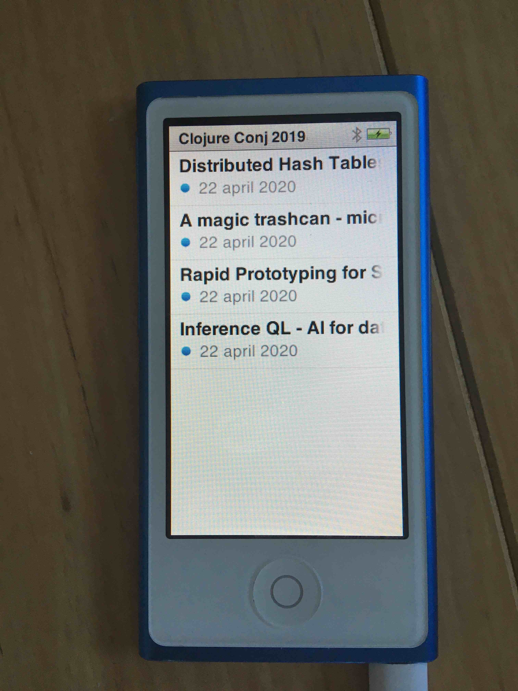

# Generate podcast

A [babashka](https://github.com/borkdude/babashka/) script to transform a
directory of mp3 files into a XML file that can read by iTunes to subscribe as
podcast.

This is a great way to enjoy conference talks on your iPod or mobile phone.

## Usage

- Place the script `generate_podcast.clj` somewhere on your path.

- Create a directory with `.mp3` files. E.g. download [Clojure Conj
2019](https://www.youtube.com/watch?v=MnvtPzEH-d8&list=PLZdCLR02grLqSy15ALLAZDU6LGpAJDrAQ)
as mp3 files with [youtube-dl](https://github.com/ytdl-org/youtube-dl).

  ``` shell
  $ mkdir -p conj2019 && cd conj2019
  $ youtube-dl -x --audio-format mp3 "https://www.youtube.com/watch?v=MnvtPzEH-d8&list=PLZdCLR02grLqSy15ALLAZDU6LGpAJDrAQ"
  ```

- Start a local webserver in the mp3-files directory

   ``` shell
   $ python -m SimpleHTTPServer
   ```

- In another session generate the podcast file from inside the mp3-files directory:

   ``` shell
   $ generate_podcast.clj -h
   podcast.clj:

   -f --file FILE Podcast file to generate :default podcast.xml
   -t --title TITLE Title for the podcast
   -b --base-url URL Base URL of server
   -h --help
   $ generate_podcast.clj -p conj2019.xml -b http://localhost:8000 -t "Clojure Conj 2019"
   Written podcast for Clojure Conj 2019 at podcast.xml
   ```

- In iTunes, subscribe to the podcast: `File > Subscribe to podcast > http://localhost:8000/conj2019.xml`.

Happy listening!



## License

Copyright © 2020 Michiel Borkent

Distributed under the EPL License. See LICENSE.
